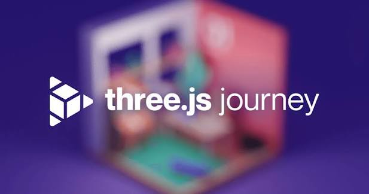

# Three.js Journey



My exercises and notes from the [Three.js Journey](https://threejs-journey.com/) course, by Bruno Simon.

Each lesson is a standalone project inside `lessons/`.

## Running a lesson

```bash
cd "lessons/03 - First Project"   # or any other lesson
npm install   # first time only
npm run dev   # runs at localhost:5173
```
